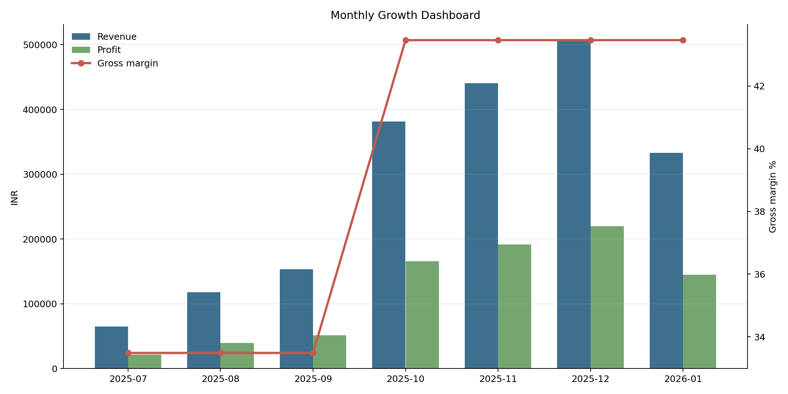
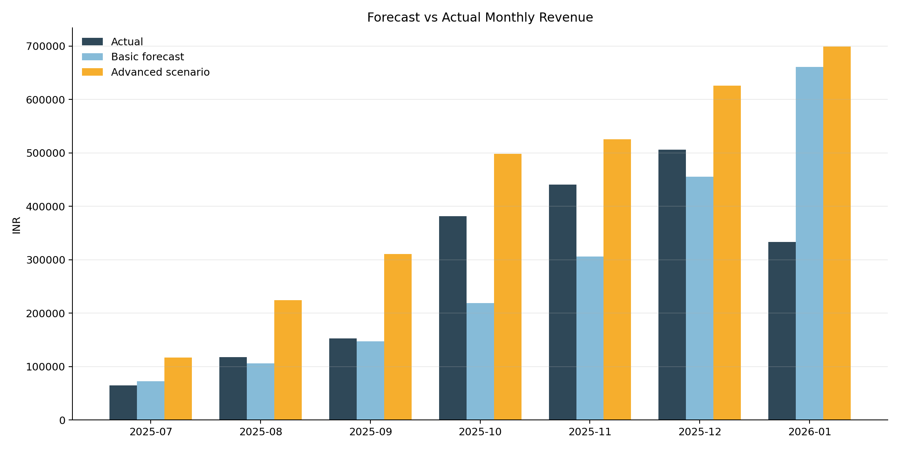
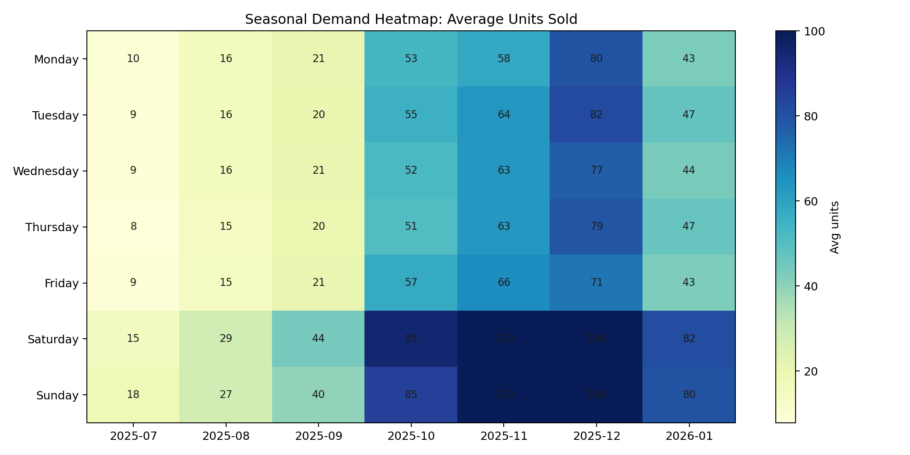
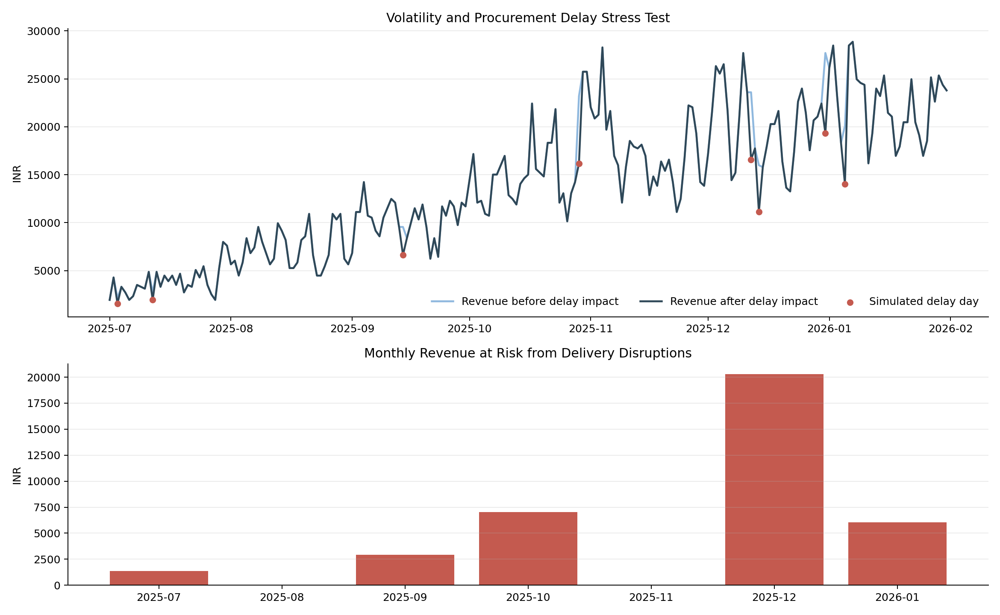

# Serene Scents: Business Analytics and Forecasting Case Study

Portfolio-grade end-to-end analytics project for an early-stage handmade scented candle venture. The project converts daily sales, cost, profit, and forecasting scripts from July 2025 to January 2026 into a business-ready narrative, KPI model, forecast evaluation, and BI dashboard blueprint.

## Project Snapshot

Serene Scents was a home fragrance startup selling handmade scented candles. Demand was shaped by gifting behavior, weekend shopping, Diwali-season spikes, raw material availability, delivery delays, pricing discipline, and production capacity. During the July 2025 to January 2026 operating window, the business moved from small-batch production toward a more scalable forecasting and business intelligence model.

The analytical goal was not only to forecast revenue. It was to help the founder answer practical operating questions:

- How fast is revenue growing, and is profit scaling with it?
- Did the October cost optimization improve unit economics?
- How much do festival windows and weekends change demand?
- Where do procurement delays and capacity limits put revenue at risk?
- How should a founder use forecasts for inventory, pricing, and procurement decisions?

## Executive KPIs

| Metric | Result |
|---|---:|
| Analysis period | 2025-07-01 to 2026-01-31 |
| Units sold | 10,240 |
| Actual revenue | INR 1,996,800 |
| Actual profit | INR 834,328 |
| Actual gross margin | 41.8% |
| Average units per day | 47.6 |
| Peak actual units per day | 100 |
| July revenue | INR 65,130 |
| December revenue | INR 505,830 |
| July to December revenue growth | 676.6% |
| Pre-optimization margin | 33.5% |
| Post-optimization margin | 43.5% |
| Festival window daily revenue lift | 54.2% |
| Weekend unit demand lift | 61.6% |
| Simulated delivery delay revenue at risk | INR 37,635 |

## Visual Analytics

The project now includes a Power BI-free interactive dashboard for macOS:

[Open the interactive dashboard](dashboard/index.html)









## Business Story

Serene Scents began the period with low daily volume and manual production economics. July revenue was INR 65,130, with the business operating at a 33.5% margin based on an initial unit cost of INR 129.70 and a selling price of INR 195. By October, cost optimization was modeled through wholesale raw material procurement and better production planning, reducing unit cost by 15% to about INR 110.25. This lifted gross margin to 43.5% without increasing price.

The growth curve was not smooth. Revenue accelerated sharply from September to October, rising 149.2% month over month, supported by festive demand and stronger operating maturity. December became the strongest revenue month at INR 505,830. January then declined 34.1% from December, highlighting the difference between seasonal peaks and sustainable baseline demand.

The project frames this as a founder decision problem: scale capacity ahead of gift-heavy windows, protect margin through procurement discipline, and avoid over-reading seasonal peaks as permanent demand.

## Forecasting Evolution

### Phase 1: Basic Linear Growth Forecast

The first model used a simple growth path from 10 to 130 daily units, a fixed selling price of INR 195, and a planned October cost reduction. It was useful for early financial planning because it translated unit growth into revenue, cost, and profit.

Strengths:

- Easy to explain to non-technical stakeholders
- Strong for quick revenue and profit estimation
- Clear unit economics based on cost and price assumptions

Limitations:

- Did not model weekends, gifting seasons, demand volatility, procurement disruptions, or capacity pressure
- Treated growth as smoother than real startup operations
- Could not explain why demand spiked or softened

### Phase 2: Advanced Real-World Forecast

The upgraded model introduced seasonality, Diwali demand boosts, volatility logic, delivery disruption modeling, capacity caps, and business intelligence summaries. It turned the forecast from a static projection into an operating scenario model.

Variables introduced:

- Weekly and monthly seasonality
- Diwali-period demand boost around 2025-10-20 and 2025-11-01
- Random market volatility
- Delivery delay flags with unit sales reduction assumptions
- 130-unit modeled capacity ceiling
- October cost optimization from INR 129.70 to about INR 110.25

The advanced model is best interpreted as a stress-test and planning model. Against the provided actuals, the basic model had a small aggregate revenue bias of -1.5%, while the advanced scenario over-forecast revenue by 50.2%. That is a valuable portfolio insight: the advanced model improved business realism, but it still needed calibration against actual demand, post-festival softness, and observed production capacity.

## Core Insights

| Insight | Business meaning | Decision supported |
|---|---|---|
| Margin improved from 33.5% to 43.5% after October | Procurement and cost discipline mattered as much as demand growth | Negotiate wholesale wax, oil, jars, labels, and packaging earlier |
| Festival-window revenue was 54.2% higher per day | Gifting periods changed the demand baseline | Pre-build inventory and bundles before Diwali |
| Weekend unit demand was 61.6% higher than weekday demand | Purchase behavior was concentrated around high-intent shopping days | Schedule production, fulfillment, and promotions around weekends |
| December revenue peaked, then January declined 34.1% | Seasonal demand should not be mistaken for permanent scale | Separate baseline forecasts from seasonal uplift scenarios |
| Advanced forecast overestimated actuals by 50.2% | Scenario models need feedback loops and calibration | Add actual-vs-forecast monitoring and rolling forecast updates |
| Simulated delays put INR 37,635 revenue at risk | Procurement inconsistency can directly reduce sales capacity | Track supplier lead time, reorder points, and safety stock |

## Methodology

1. Cleaned daily actual growth data and standardized date, unit, revenue, cost, and profit columns.
2. Rebuilt the basic forecast using geometric unit growth, fixed price, and October cost optimization.
3. Ingested the advanced forecast with seasonality and festival boost logic.
4. Added a reproducible stress-test layer for market volatility and delivery disruption impact.
5. Built actual-vs-forecast diagnostics using MAE, RMSE, MAPE, and revenue bias.
6. Produced monthly KPI tables, festival analysis, cost-phase analysis, and visual dashboards.
7. Converted results into recruiter-friendly business storytelling assets.

## Project Structure

```text
serene-scents-analytics/
  README.md
  requirements.txt
  data/
    raw/
      serene_scents_actual_growth.csv
      serene_scents_advanced_forecast.csv
    processed/
      actual_clean.csv
      monthly_kpis.csv
      model_comparison.csv
      daily_forecast_comparison.csv
      advanced_stress_test_forecast.csv
  docs/
    executive_summary.md
    business_case_study.md
    technical_documentation.md
    dashboard_blueprint.md
    linkedin_resume_assets.md
    presentation_outline.md
    data_dictionary.md
  outputs/
    figures/
      monthly_growth_dashboard.png
      forecast_vs_actual_revenue.png
      seasonal_demand_heatmap.png
      volatility_delay_impact.png
  powerbi/
    README.md
  dashboard/
    README.md
    index.html
  notebooks/
    README.md
    SereneScents_original.ipynb
  sql/
    kpi_queries.sql
  src/
    serene_scents_pipeline.py
    basic_forecasting_model_original.py
    advanced_forecasting_model_original.py
    business_analysis_original.py
```

## Reproduce the Analysis

```bash
pip install -r requirements.txt
python src/serene_scents_pipeline.py
```

The pipeline writes cleaned tables to `data/processed/`, figures to `outputs/figures/`, and a compact KPI JSON summary to `outputs/serene_scents_executive_summary.json`.

## Recommended Stack

- Python for modeling and reproducible analysis
- Pandas and NumPy for data cleaning, KPI calculation, and forecast logic
- Matplotlib or Plotly for trend, margin, and simulation visuals
- SQL for KPI extraction and dashboard-ready aggregation
- Power BI for executive dashboarding and stakeholder reporting
- Forecasting methods: trend forecasting, seasonality adjustment, scenario modeling, variance analysis, and actual-vs-forecast diagnostics

## Portfolio Positioning

This project demonstrates business analytics judgment rather than only technical charting. It shows how a data analyst can move from raw startup data to founder-level decisions: pricing, procurement, inventory planning, seasonal readiness, margin control, and forecast governance.

See the supporting docs for the executive summary, business case study, dashboard blueprint, LinkedIn copy, resume bullets, and presentation outline.
